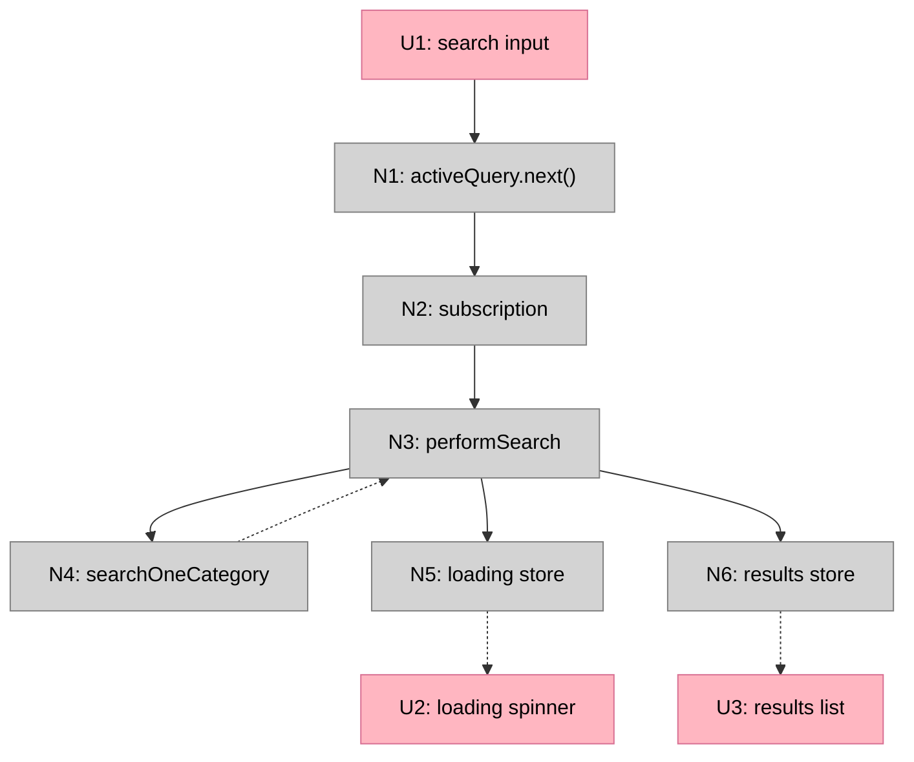
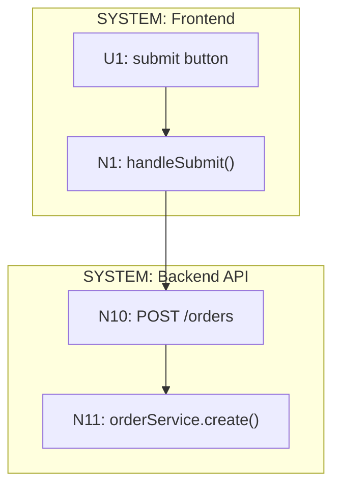
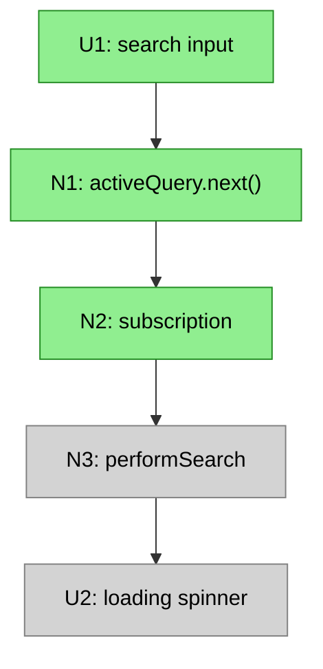

# Breadboarding

Breadboarding transforms a workflow description into a complete map of affordances and their relationships. The output is always a set of tables showing numbered UI and Code affordances with their Wires Out and Returns To relationships. The tables are the truth. Mermaid diagrams are optional visualizations for humans.

---

## Two Applications

### R1: Mapping an Existing System

**When to use:** You don't understand how an existing system works in its concrete details. You have a workflow you're trying to understand — explaining how something happens or why something doesn't happen.

**Input:**
- Code repo(s) to analyze
- Workflow description (always from the perspective of an operator trying to make an effect happen — through UI or as a caller)

**Output:**
- UI Affordances table
- Code Affordances table
- (Optional) Mermaid visualization

**Note:** If the workflow spans multiple applications (frontend + backend), create ONE breadboard that tells the full story. Label places to show which system they belong to.

---

### R2: Designing from Shaped Parts

**When to use:** You have a new system sketched as an assembly of parts (mechanisms) per shaping. You need to detail out the concrete mechanism and show how those parts interact as a system.

**Input:**
- Parts list (mechanisms from shaping)
- The R (requirement/outcome) the parts are meant to achieve
- Existing system (optional) — if the new parts must interoperate with existing code

**Output:**
- UI Affordances table
- Code Affordances table
- (Optional) Mermaid visualization

---

### Mixtures

Often you have both: an existing system that must remain as-is, plus new pieces or changes defined in a shape. In this case, breadboard both together — the existing affordances and the new ones — showing how they connect.

---

## Core Concepts

### Places
A place is somewhere the user can navigate to in the UI. Each place:
- Has a route/URL the user can visit
- Contains UI affordances that are rendered there
- Is fed by Code affordances that produce the data for those UI affordances

All UI affordances exist within some place. When the user navigates, they move from one place to another.

When spanning multiple systems, label places with their system (e.g., `PLACE: Checkout Page (frontend)`, `PLACE: Payment API (backend)`).

### Affordances
Things you can act upon:
- **UI affordances (U)**: inputs, buttons, displayed elements, scroll regions
- **Code affordances (N)**: methods, subscriptions, data stores, framework mechanisms

### Wiring
How affordances connect to each other:

**Wires Out** — What an affordance triggers or calls (control flow):
- Call wires: one affordance calls another
- Write wires: code writes to a data store
- Navigation wires: routing to a different place

**Returns To** — Where an affordance's output flows (data flow):
- Return wires: function returns value to its caller
- Read wires: data store is read by another affordance

This separation makes data flow explicit. Wires Out show control flow (what triggers what). Returns To show data flow (where output goes).

---

## The Output: Affordance Tables

The tables are the truth. Every breadboard produces these:

### UI Affordances Table

| # | Component | Affordance | Control | Wires Out | Returns To |
|---|-----------|------------|---------|-----------|------------|
| U1 | search-detail | search input | type | → N1 | — |
| U2 | search-detail | loading spinner | render | — | — |
| U3 | search-detail | results list | render | — | — |

### Code Affordances Table

| # | Component | Affordance | Control | Wires Out | Returns To |
|---|-----------|------------|---------|-----------|------------|
| N1 | search-detail | `activeQuery.next()` | call | → N2 | — |
| N2 | search-detail | `activeQuery` subscription | observe | → N3 | — |
| N3 | search-detail | `performSearch()` | call | → N4, → N5, → N6 | — |
| N4 | search.service | `searchOneCategory()` | call | → N7 | → N3 |
| N5 | search-detail | `loading` | write | store | → U2 |
| N6 | search-detail | `results` | write | store | → U3 |
| N7 | typesense.service | `rawSearch()` | call | — | → N4 |

### Column Definitions

| Column | Description |
|--------|-------------|
| **#** | Unique ID (U1, U2... for UI; N1, N2... for Code) |
| **Component** | Which component/service owns this |
| **Affordance** | The specific thing you can act upon |
| **Control** | The triggering event: click, type, call, observe, write, render |
| **Wires Out** | What this triggers: `→ N4, → N6` (control flow) |
| **Returns To** | Where output flows: `→ N3` or `→ U2, U3` (data flow) |

---

## Procedures

### For R1: Mapping an Existing System

**Step 1: Identify the flow to analyze**

Pick a specific user journey. Always frame it as an operator trying to do something:
- "Land on /search, type query, scroll for more, click result"
- "Call the payment API with a card token, expect a charge to be created"

**Step 2: List all places involved**

Walk through the journey and identify each distinct place the user visits or system boundary crossed.

**Step 3: Trace through the code to find components**

Starting from the entry point (route, API endpoint), trace through the code to find every component touched by that flow.

**Step 4: For each component, list its affordances**

Read the code. Identify:
- UI: What can the user see and interact with?
- Code: What methods, subscriptions, stores are involved?

**Step 5: Name the actual thing, not an abstraction**

If you write "DATABASE", stop. What's the actual method? (`userRepo.save()`). Every affordance name must be something real you can point to in the code.

**Step 6: Fill in Control column**

For each affordance, what triggers it? (click, type, call, observe, write, render)

**Step 7: Fill in Wires Out**

For each affordance, what does it trigger? Read the code — what does this method call? What does this button's handler invoke?

**Step 8: Fill in Returns To**

For each affordance, where does its output flow?
- Functions that return values → list the callers that receive the return
- Data stores → list the affordances that read from them
- No meaningful output → use `—`

**Step 9: Add data stores as affordances**

When code writes to a property that is later read by another affordance, add that property as a Code affordance with control type `write`.

**Step 10: Add framework mechanisms as affordances**

Include things like `cdr.detectChanges()` that bridge between code and UI rendering. These show how state changes actually reach the UI.

**Step 11: Verify against the code**

Read the code again. Confirm every affordance exists and the wiring matches reality.

---

### For R2: Designing from Shaped Parts

**Step 1: List each part from the shape**

Take each mechanism/part identified in shaping and write it down.

**Step 2: Translate parts into affordances**

For each part, identify:
- What UI affordances does this part require?
- What Code affordances implement this part?

**Step 3: Verify every U has a supporting N**

For each UI affordance, check: what Code affordance provides its data or controls its rendering? If none exists, add the missing N.

**Step 4: Classify places as existing or new**

For each UI affordance, determine whether it lives in:
- An existing place being modified
- A new place being created

**Step 5: Wire the affordances**

Fill in Wires Out and Returns To for each affordance. Trace through the intended behavior — what calls what? What returns where?

**Step 6: Connect to existing system (if applicable)**

If there's an existing codebase:
- Identify the existing affordances the new ones must connect to
- Add those existing affordances to your tables
- Wire the new affordances to them

**Step 7: Check for completeness**

- Every U should have an N that feeds it
- Every N should have either Wires Out or Returns To (or both)
- Handlers → should have Wires Out
- Queries → should have Returns To
- Data stores → should have Returns To

**Step 8: Treat user-visible outputs as Us**

Anything the user sees (including emails, notifications) is a UI affordance and needs an N wiring to it.

---

## Key Principles

### Never use memory — always check the data

When tracing a flow backwards, don't follow the path you remember. Scan the Wires Out column for ALL affordances that wire to your target.

When filling in the tables, read each row systematically. Don't rely on what you think you know.

The tables are the source of truth. Your memory is unreliable.

### Every affordance name must exist (R1)

When mapping existing code, never invent abstractions. Every name must point to something real in the codebase.

### Every U needs an N

A UI affordance can't appear unless something generates it. If a U has no N feeding it, either add the N or question whether the U is real.

### Every N must connect

If a Code affordance has no Wires Out AND no Returns To, something is wrong:
- Handlers → should have Wires Out (what they call or write)
- Queries → should have Returns To (who receives their return value)
- Data stores → should have Returns To (which affordances read them)

### Separate control flow from data flow

Wires Out = control flow (what triggers what)
Returns To = data flow (where output goes)

This separation makes the system's behavior explicit.

### Show navigation inline, not as loops

Routing is a generic mechanism every page uses. Instead of drawing all navigation through a central Router affordance, show `Router navigate()` inline where it happens and wire directly to the destination place.

---

## Visualization (Mermaid)

The tables are the truth. Mermaid diagrams are optional visualizations for humans.

### Basic Structure



### Line Conventions

| Line Style | Mermaid Syntax | Use |
|------------|----------------|-----|
| Solid (`-->`) | `A --> B` | Wires Out: calls, triggers, writes |
| Dashed (`-.->`) | `A -.-> B` | Returns To: return values, data store reads |

### Color Conventions

| Type | Color | Hex |
|------|-------|-----|
| UI affordances | Pink | `#ffb6c1` |
| Code affordances | Grey | `#d3d3d3` |
| Component references | Lavender | `#e6e6fa` |

```mermaid
classDef ui fill:#ffb6c1,stroke:#d87093,color:#000
classDef nonui fill:#d3d3d3,stroke:#808080,color:#000
classDef component fill:#e6e6fa,stroke:#9370db,color:#000
```

### Subgraph Labels

| Type | Label Pattern | Purpose |
|------|---------------|---------|
| Place | `PLACE: Name` | A route/page the user visits |
| Trigger | `TRIGGER: Name` | An event that kicks off a flow (not navigable) |
| Component | `COMPONENT: Name` | Reusable UI+logic that appears in multiple places |
| Data stores | `DATA STORES` | Tables and state that persist |
| System | `SYSTEM: Name` | When spanning multiple applications |

### When spanning multiple systems



---

## Slicing a Breadboard

Slicing takes a breadboard and groups its affordances into **vertical implementation slices**.

**Input:**
- Breadboard (affordance tables with wiring)
- Shape (R + mechanisms) — guides what demos matter

**Output:**
- Breadboard with affordances assigned to slices V1–V9 (max 9 slices)

### What is a Vertical Slice?

A vertical slice is a group of UI and Code affordances that does something demo-able. It cuts through all layers (UI, logic, data) to deliver a working increment.

The opposite is a horizontal slice — doing work on one layer (e.g., "set up all the data models") that isn't clickable from the interface.

**Demo-able means:**
- Has an entry point (UI interaction or trigger)
- Has an observable output (UI renders, effect occurs)
- Shows meaningful progress toward the R

The shape guides what counts as "meaningful progress" — you're not just grouping affordances arbitrarily, you're grouping them to demonstrate mechanisms working.

### Wires to Future Slices

A slice may contain affordances with Wires Out pointing to affordances in later slices. These wires exist in the breadboard but aren't implemented yet — they're stubs or no-ops until that later slice is built.

This is normal. The breadboard shows the complete system; slicing shows the order of implementation.

### Procedure

**Step 1: Identify the minimal demo-able increment**

Look at your breadboard and shape. Ask: "What's the smallest subset that demonstrates the core mechanism working?"

Usually this is:
- The core data fetch
- Basic rendering
- No search, no pagination, no state persistence yet

This becomes V1.

**Step 2: Layer additional capabilities as slices**

Look at the mechanisms in your shape. Each slice should demonstrate a mechanism working:
- V2: Search input (demonstrates the search mechanism)
- V3: Pagination/infinite scroll (demonstrates the pagination mechanism)
- V4: URL state persistence (demonstrates the state preservation mechanism)
- etc.

**Max 9 slices.** If you have more, combine related mechanisms. Features that don't make sense alone should be in the same slice.

**Step 3: Assign affordances to slices**

Go through every affordance and assign it to the slice where it's first needed to demo that slice's mechanism:

| Slice | Mechanism | Affordances |
|-------|-----------|-------------|
| V1 | Core display | U2, U3, N3, N4, N5, N6, N7 |
| V2 | Search | U1, N1, N2 |
| V3 | Pagination | U10, N11, N12, N13 |

Some affordances may have Wires Out to later slices — that's fine. They're implemented in their assigned slice; the wires just don't do anything yet.

**Step 4: Create per-slice affordance tables**

For each slice, extract just the affordances being added:

**V2: Search Works**

| # | Component | Affordance | Control | Wires Out | Returns To |
|---|-----------|------------|---------|-----------|------------|
| U1 | search-detail | search input | type | → N1 | — |
| N1 | search-detail | `activeQuery.next()` | call | → N2 | — |
| N2 | search-detail | `activeQuery` subscription | observe | → N3 | — |

**Step 5: Write a demo statement for each slice**

Each slice needs a concrete demo that shows its mechanism working toward the R:
- V1: "Widget shows real data from the API"
- V2: "Type 'dharma', results filter live"
- V3: "Scroll down, more items load"

The demo should be something you can show a stakeholder that demonstrates progress.

### Visualizing Slices in Mermaid

Show the complete breadboard in every slice diagram, but use styling to distinguish scope:

| Category | Style | Description |
|----------|-------|-------------|
| **This slice** | Bright color | Affordances being added |
| **Already built** | Solid grey | Previous slices |
| **Future** | Transparent, dashed border | Not yet built |



This lets stakeholders see:
- What's being built now (highlighted)
- What already exists (grey)
- What's coming later (faded)

### Slice Summary Format

| # | Slice | Mechanism | Demo |
|---|-------|-----------|------|
| V1 | Widget with real data | F1, F4, F6 | "Widget shows letters from API" |
| V2 | Search works | F3 | "Type to filter results" |
| V3 | Infinite scroll | F5 | "Scroll down, more load" |
| V4 | URL state | F2 | "Refresh preserves search" |

The Mechanism column references parts from the shape, showing which mechanisms each slice demonstrates.
